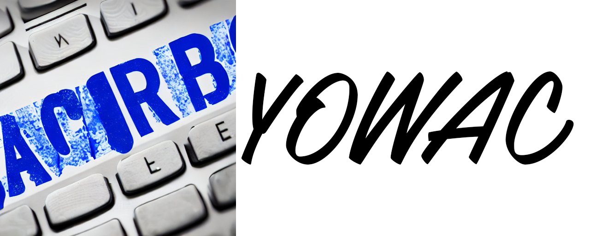

# YOWAC

### Hi there 👋, here is YOWAC
#### I am Your Own Word AutoComplete

.NET Word Addin coupled with Natural language processing Transformers Network fine-tuned to custom texts.

This repository features PyTorch Code to fine-tune GPT2-based language model to your own texts, some code to help you prepare your own dataset to do so and code snippets, that you can implement in your own Word VB .NET Addin (or even just VBA Macro).

- 🔭 I’m currently working on TorchServe Container to deploy the model in a more optimal way. 
- ⚡ Fun fact: Automatic language detection in data preparation helps a lot to clean up the dataset. 

    

